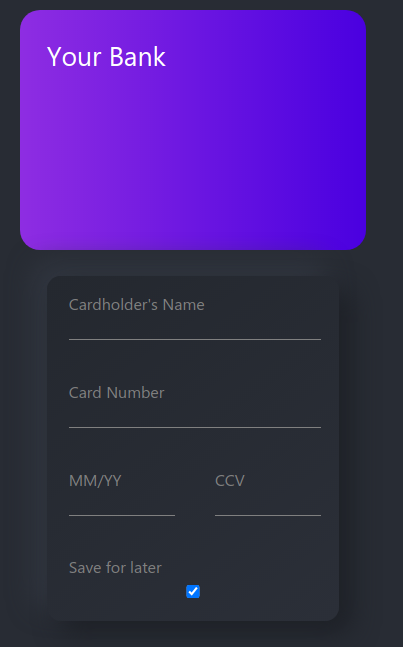
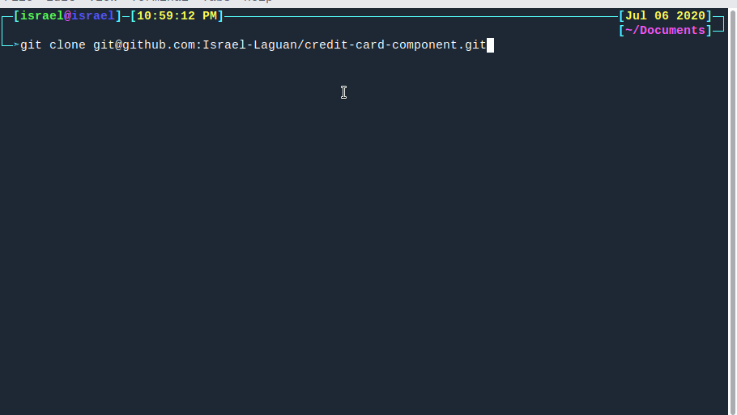
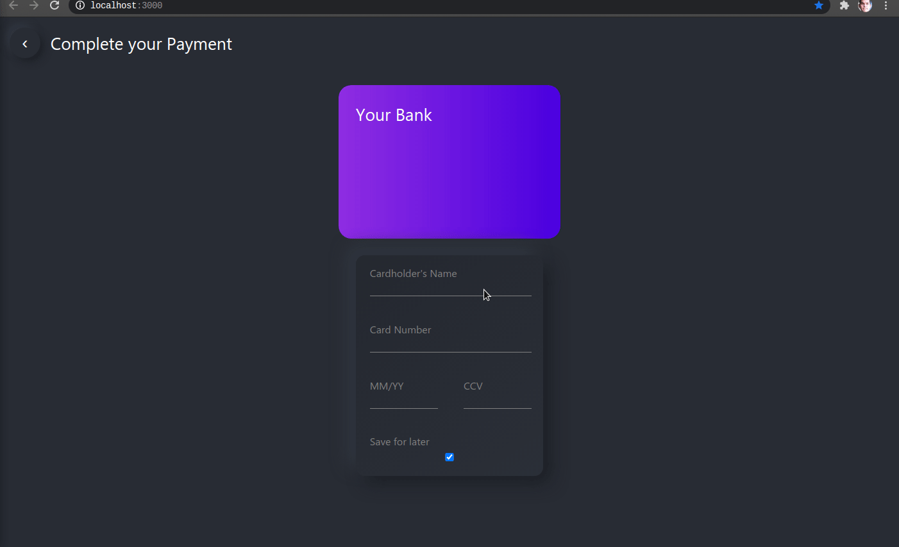

# Credit Card Component

<!-- PROJECT SHIELDS -->
[![Forks][forks-shield]][forks-url]
[![Stargazers][stars-shield]][stars-url]
[![Issues-open][issues-open-shield]][issues-url]
[![Issues-closed][issues-closed-shield]][issues-url]
[![Contributors][contributors-shield]][contributors-url]
[![contributions welcome][contributions-welcome]][issues-url]

<!-- PROJECT LOGO -->
<br/>
<p align="center">
  <a href="https://github.com/Israel-Laguan/credit-card-component/">
    
  </a>

  <h2 align="center">
	Base for a Credit Card component in React
  </h2>
  <p align="center">
    <br/>
    <a href="https://github.com/Israel-Laguan/credit-card-component/issues">Report a Bug</a>
    🙋‍♂️
    <a href="https://github.com/Israel-Laguan/credit-card-component/issues">Request Feature</a>
  </p>
</p>

# [Live Version Here](http://credit-card-component.surge.sh/)



## Table of Contents

- [Credit Card Component](#credit-card-component)
- [Live Version Here](#live-version-here)
  - [Table of Contents](#table-of-contents)
- [The Project](#the-project)
  - [Features](#features)
  - [Run It](#run-it)
    - [Prerequisites](#prerequisites)
    - [Setup](#setup)
    - [Available Scripts](#available-scripts)
      - [`npm start`](#npm-start)
      - [`npm test`](#npm-test)
      - [`npm run publish`](#npm-run-publish)
  - [Author](#author)
  - [Contributing](#contributing)
  - [Show your support](#show-your-support)
  - [License](#license)

# The Project

Card type detection using regex for a credit card form component. As managing money for programmers is important, we have to make sure things like card issuer are as the user says; also we have to take care of the looks.

This projects shows how to check dynamically for the Network issuing certain cards based on the [Issuer identification number (IIN)](https://en.wikipedia.org/wiki/Payment_card_number). This way we can create better user experience and take care of security issues, for example validating client-side the card number.

Based on [this gist](https://gist.github.com/andreamiranda019/8f768ce78ae6a1095d7c42218c168c34)

## Features

![javascript][]
![react][]
[![Framework][badge-framework]][framework-url]
![css][]

- Using Create React App (CRA)
- No Style Framework, only pure CSS (Looking at you Bootstrap...)
- React-Router
- Mobile Optimized

## Run It

This project was bootstrapped with [Create React App](https://github.com/facebook/create-react-app). So is already setup to be wasily developed and run.

### Prerequisites

You will need [Node.js](https://nodejs.org) version 8.0 or greater installed on your system.

### Setup

Get the code by either cloning this repository using git

```bash
git clone git@github.com:Israel-Laguan/credit-card-component.git
```

... or [downloading source code](git@github.com:Israel-Laguan/credit-card-component.git/archive/master.zip) as a zip archive.



Once downloaded, open the terminal in the project directory, and install dependencies with:

```bash
npm install
```

Then start the app with:

```bash
npm start
```

The app should now be up and running at http://localhost:3000 🚀



### Available Scripts

In the project directory, you can run:

#### `npm start`

Runs the app in the development mode.

Open [http://localhost:3000](http://localhost:3000) to view it in the browser.

The page will reload if you make edits.

You will also see any lint errors in the console.

#### `npm test`

Launches the test runner in the interactive watch mode.

See the section about [running tests](https://facebook.github.io/create-react-app/docs/running-tests) for more information.


#### `npm run publish`

Builds and then publish the app to `surge.sh`, in this case to `http://credit-card-component.surge.sh/`.

## Author

<table style="width:100%">
  <tr>
    <td>
        <div align="center">
            <a href="./docs/img/photo.png" target="_blank" rel="author">
                
            </a>
            <h2>
                <a href="https://israel-laguan.github.io/" target="_blank" rel="author">
                    Israel Laguan
                </a>
            </h2>
        </div>
    </td>
    <td>
        <div align="center">
            <a href="mailto:israellaguan@gmail.com" target="_blank" rel="author">
                
                <h3>
                    Email me to 
                    <a href="mailto:israellaguan@gmail.com">
                        israellaguan@gmail.com
                    </a>
                </h3>
            </a>
            <a href="https://www.linkedin.com/in/israellaguan/" target="_blank" rel="author">
                
                <h3>
                    Connect to my Linkedin
                </h3>
            </a>
            <a href="https://github.com/Israel-Laguan" target="_blank" rel="author">
                
                <h3>
                    Check my GitHub Profile
                </h3>
            </a>
        </div>
    </td>
  </tr>
</table> 

## Contributing

[![contributions welcome][contributions-welcome]][issues-url]

🤝 Contributions, issues and feature requests are welcome!
Feel free to check the [issues page][issues-url].

## Show your support

🤗 Give a ⭐️ if you like this project!

Icon from:

<a target="_blank" href="https://icons8.com">Icons8</a>

Regexs: Adapted form [here](https://www.w3resource.com/javascript/form/credit-card-validation.php)
Design Idea: [Dribble](https://dribbble.com/shots/11991452-Daily-UI-Challenge-002-Credit-Card-Checkout-Neumorphism)

## License

[![License][badge-apache]][apache-license]

📝 This project is licensed under the [Apache 2](LICENSE)\
Feel free to fork this project and improve it

<!-- MARKDOWN LINKS & IMAGES -->
[contributors-shield]: https://img.shields.io/github/contributors/Israel-Laguan/credit-card-component?style=for-the-badge
[contributors-url]: https://github.com/Israel-Laguan/credit-card-component/graphs/contributors
[forks-shield]: https://img.shields.io/github/forks/Israel-Laguan/credit-card-component?style=for-the-badge
[forks-url]: https://github.com/Israel-Laguan/credit-card-component/network/members
[stars-shield]: https://img.shields.io/github/stars/Israel-Laguan/credit-card-component?style=for-the-badge
[stars-url]: https://github.com/Israel-Laguan/credit-card-component/stargazers
[issues-open-shield]: https://img.shields.io/github/issues/Israel-Laguan/credit-card-component?style=for-the-badge
[issues-url]: https://github.com/Israel-Laguan/credit-card-component/issues
[issues-closed-shield]: https://img.shields.io/github/issues-closed/Israel-Laguan/credit-card-component?style=for-the-badge
[badge-framework]: https://img.shields.io/badge/store-Redux-000?style=for-the-badge&logo=redux
[framework-url]: https://redux.js.org/
[contributions-welcome]: https://img.shields.io/badge/contributions-welcome-brightgreen.svg?style=for-the-badge
[badge-apache]: https://img.shields.io/badge/License-Apache%202.0-blue.svg?style=for-the-badge
[apache-license]: https://opensource.org/licenses/Apache-2.0
[react]: https://img.shields.io/badge/React-16+-61DAFB?style=for-the-badge&logo=react
[javascript]: https://img.shields.io/badge/JAVASCRIPT-ES6%2B-F7DF1E?style=for-the-badge&logo=javascript
[css]: https://img.shields.io/badge/style-CSS-1572B6?style=for-the-badge&logo=css3
